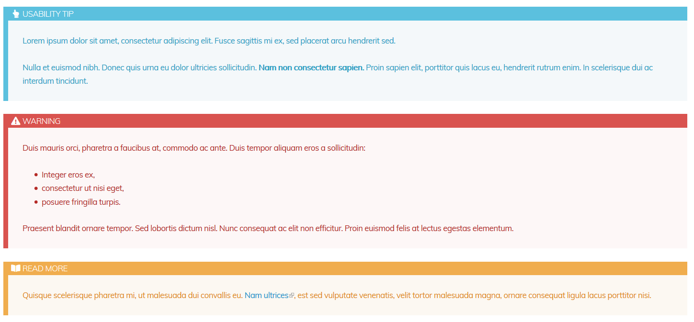
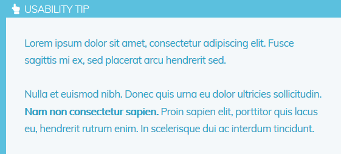

# Grav Markdown Boxouts Plugin

The **markdown-boxouts plugin** for [Grav](http://github.com/getgrav/grav) generates content boxouts that have an icon, title and body:



# Installation

Copy contents into `user/plugins/markdown-boxouts/`

# Configuration

Simply copy the `user/plugins/markdown-boxouts/markdown-boxouts.yaml` into `user/config/plugins/markdown-boxouts.yaml` and make your modifications. You can also define/change the colour and styles of the boxouts in `user/plugins/markdown-boxouts/assets/boxouts.css`

# Examples

## Configuration Example

* Tip
	* **classname:** tip
	* **heading:** 'Usability Tip'
    * **fontawesome:** fa-hand-point-up

## Usage Example

Entering this:

```
!(tip) Lorem ipsum dolor sit amet, consectetur adipiscing elit. Fusce sagittis mi ex, sed placerat arcu hendrerit sed.
! 
! Nulla et euismod nibh. Donec quis urna eu dolor ultricies sollicitudin. **Nam non consectetur sapien.** Proin sapien elit, porttitor quis lacus eu, hendrerit rutrum enim. In scelerisque dui ac interdum tincidunt.
```

will produce the following HTML:

```
<div class="boxout tip">
    <div class="boxout-header"><i class="fa fa-fw fa-hand-point-up"></i> Usability Tip</div>
    <div class="boxout-body">
        <p>Lorem ipsum dolor sit amet, consectetur adipiscing elit. Fusce sagittis mi ex, sed placerat arcu hendrerit sed.</p>
        <p>Nulla et euismod nibh. Donec quis urna eu dolor ultricies sollicitudin. <strong>Nam non consectetur sapien.</strong> Proin sapien elit, porttitor quis lacus eu, hendrerit rutrum enim. In scelerisque dui ac interdum tincidunt.</p>
    </div>
</div>
```

and display this:



# Acknowledgements

This plugin was inspired by the [Markdown Notices](https://github.com/getgrav/grav-plugin-markdown-notices) plugin developed by the Grav Team.